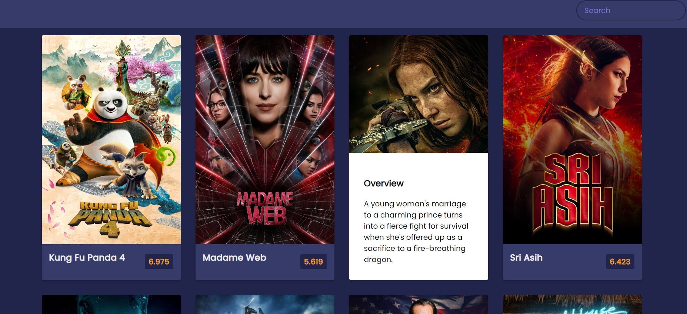
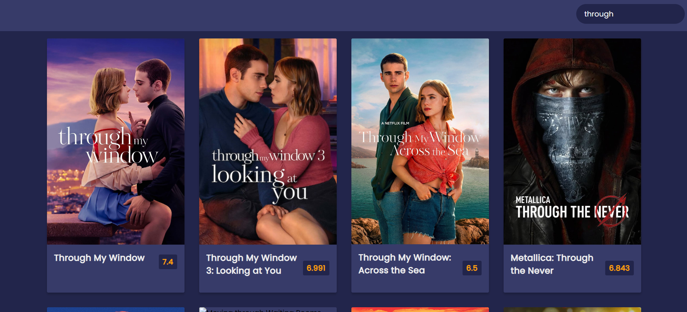
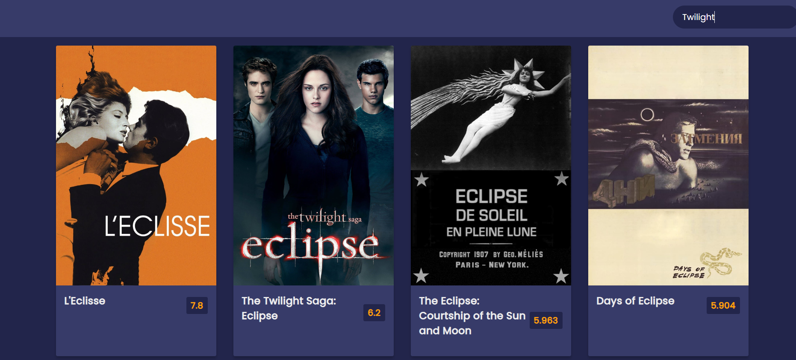

# MovieHub

MovieHub es una aplicación web que te permite explorar y descubrir una amplia variedad de películas. Con una interfaz intuitiva y atractiva, MovieHub te brinda acceso a una extensa base de datos de películas, donde podrás buscar por título.  

## Características principales:

- **Exploración de películas:** Busca películas por título.
- **Detalles de la película:** Obtén una descripción sobre cada película, incluyendo sinopsis y clasificación.
- **Interfaz intuitiva:** Una interfaz de usuario limpia y fácil de usar, diseñada para una experiencia de navegación fluida.

## Tecnologías utilizadas:

- **JavaScript:** Utilizamos JavaScript para la lógica de la aplicación, incluyendo la manipulación del DOM y la interacción con la API de películas.
- **HTML:** La estructura básica de la aplicación está construida con HTML para garantizar una accesibilidad adecuada y una correcta representación de los datos.
- **CSS:** Utilizamos CSS para dar estilo y diseño a la aplicación, asegurando una experiencia visual atractiva y coherente.

## Contribución:

¡Estamos abiertos a contribuciones! Si tienes ideas para nuevas características, mejoras en el código o correcciones de errores, ¡no dudes en colaborar con nosotros!

## Instalación y Uso:

1. Clona este repositorio: `git clone https://github.com/wilderTorres18/movieHub`
2. Abre el archivo `index.html` en tu navegador web.
3. ¡Explora y disfruta de MovieHub!

## Capturas de pantalla:

¡Esperamos que disfrutes usando MovieHub tanto como nosotros disfrutamos creándolo!

---
